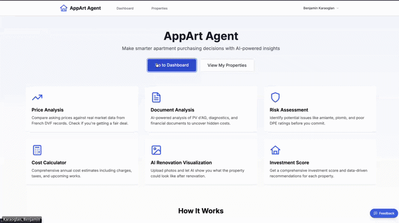

<p align="center">
  <h1 align="center">AppArt Agent</h1>
  <p align="center">
    AI-powered apartment purchasing decision platform for the French real estate market
  </p>
</p>

<p align="center">
  <a href="https://github.com/benjamin-karaoglan/AppArtAgent/actions/workflows/deploy.yml">
    
  </a>
  <a href="https://github.com/benjamin-karaoglan/AppArtAgent/actions/workflows/docs.yml">
    
  </a>
  <a href="LICENSE">
    
  </a>
  
  
  <a href="https://appartagent.com">
    
  </a>
</p>

<p align="center">
  <a href="https://appartagent.com">Try it Live</a> •
  <a href="#features">Features</a> •
  <a href="#quick-start">Quick Start</a> •
  <a href="#documentation">Documentation</a> •
  <a href="#contributing">Contributing</a> •
  <a href="#license">License</a>
</p>

---

<p align="center">
  
</p>

## Overview

AppArt Agent helps buyers make informed real estate decisions by combining:

- **4.8M+ geolocalized French property transactions** from the DVF (Demandes de Valeurs Foncières) open dataset
- **AI-powered document analysis** using Google Gemini for PV d'AG, diagnostics, taxes, and charges
- **Photo redesign visualization** to explore renovation potential
- **Comprehensive decision dashboard** with cost breakdown and risk assessment

## Features

### 📊 Price Analysis

- Address-based property search with DVF data (2022-2025) using api-adresse.data.gouv.fr for instant autocomplete
- Historical sales analysis and trend projections
- Interactive 5-year market evolution chart
- IQR-based outlier detection for accurate pricing

### 📄 Document Analysis

- **Bulk Upload**: Drag & drop multiple documents at once
- **Auto-Classification**: AI identifies document types automatically
- **Parallel Processing**: All documents analyzed simultaneously
- **Synthesis**: Cross-document analysis with cost aggregation and risk assessment

### 🎨 Photo Redesign Studio

- Upload apartment photos
- AI-driven style transformation
- Visualize renovation potential

## Quick Start

### Prerequisites

- [Docker](https://docs.docker.com/get-docker/) and Docker Compose
- Google Cloud project with Vertex AI enabled, **or** a [Gemini API key](https://aistudio.google.com/) for development

### Installation

```bash
# Clone the repository
git clone https://github.com/benjamin-karaoglan/AppArtAgent.git
cd AppArtAgent

# Configure environment
cp .env.example .env
# Edit .env — set GEMINI_USE_VERTEXAI=true (production) or add GOOGLE_CLOUD_API_KEY (dev)

# Start all services (migrations run automatically)
docker-compose up -d
```

### Access the Application

| Service | URL | Description |
|---------|-----|-------------|
| Frontend | http://localhost:3000 | Web application |
| Backend API | http://localhost:8000/docs | API documentation |
| MinIO Console | http://localhost:9001 | Storage management |

## Technology Stack

| Layer | Technologies |
|-------|--------------|
| **Frontend** | Next.js 14, React 18, TypeScript, Tailwind CSS, pnpm |
| **Backend** | FastAPI, Python 3.10+, SQLAlchemy, UV |
| **AI** | Google Gemini via `google-genai` SDK (Vertex AI / REST API) |
| **Database** | PostgreSQL 15, Redis 7 |
| **Storage** | MinIO (local), Google Cloud Storage (production) |
| **Infrastructure** | Docker, Terraform, GCP Cloud Run |

## Project Structure

```text
AppArtAgent/
├── backend/                 # FastAPI backend
│   ├── app/
│   │   ├── api/            # REST API endpoints
│   │   ├── core/           # Config, database, security
│   │   ├── models/         # SQLAlchemy models
│   │   ├── schemas/        # Pydantic schemas
│   │   ├── services/       # Business logic
│   │   └── prompts/        # AI prompt templates
│   ├── alembic/            # Database migrations
│   └── scripts/            # Utility scripts
├── frontend/               # Next.js frontend
│   └── src/
│       ├── app/            # App Router pages
│       ├── components/     # React components + ui/ design system
│       └── lib/            # Utilities, API client, auth
├── docs/                   # Documentation (MkDocs)
├── infra/terraform/        # Infrastructure as Code
└── docker-compose.yml      # Local development stack
```

## Documentation

Full documentation is available at **[benjamin-karaoglan.github.io/AppArtAgent](https://benjamin-karaoglan.github.io/AppArtAgent)** or locally in the `docs/` directory.

| Section | Description |
|---------|-------------|
| [Getting Started](./docs/getting-started/) | Installation and quick start guides |
| [Architecture](./docs/architecture/) | System design and data flow |
| [Backend](./docs/backend/) | API reference and services |
| [Frontend](./docs/frontend/) | UI components and pages |
| [Deployment](./docs/deployment/) | Docker and GCP guides |
| [Development](./docs/development/) | Contributing and testing |

### Run Documentation Locally

```bash
uv run --extra docs mkdocs serve
```

## Development

### Using Docker (Recommended)

```bash
# Start services with hot-reload
./dev.sh start

# View logs
./dev.sh logs backend

# Stop services
./dev.sh stop
```

### Local Development

<details>
<summary><b>Backend Setup</b></summary>

```bash
cd backend
uv sync
uv run uvicorn app.main:app --reload
```

</details>

<details>
<summary><b>Frontend Setup</b></summary>

```bash
cd frontend
pnpm install
pnpm dev
```

</details>

## Environment Variables

<details>
<summary><b>Backend (.env) - Local with MinIO</b></summary>

```bash
DATABASE_URL=postgresql://appart:appart@db:5432/appart_agent
SECRET_KEY=your-secret-key-at-least-32-characters
STORAGE_BACKEND=minio
MINIO_ENDPOINT=minio:9000
MINIO_ACCESS_KEY=minioadmin
MINIO_SECRET_KEY=minioadmin

# AI — choose one:
GEMINI_USE_VERTEXAI=false
GOOGLE_CLOUD_API_KEY=your_google_api_key    # Only needed when GEMINI_USE_VERTEXAI=false
```

</details>

<details>
<summary><b>Backend (.env) - Local with GCS (Production Parity)</b></summary>

For testing with real GCS buckets and Vertex AI, use service account impersonation:

```bash
# One-time setup: Grant impersonation permission
gcloud iam service-accounts add-iam-policy-binding \
  appart-backend@YOUR_PROJECT.iam.gserviceaccount.com \
  --member="user:YOUR_EMAIL@gmail.com" \
  --role="roles/iam.serviceAccountTokenCreator" \
  --project=YOUR_PROJECT

# Login with impersonation
gcloud auth application-default login \
  --impersonate-service-account=appart-backend@YOUR_PROJECT.iam.gserviceaccount.com
```

Then configure `.env`:

```bash
DATABASE_URL=postgresql://appart:appart@db:5432/appart_agent
SECRET_KEY=your-secret-key-at-least-32-characters
STORAGE_BACKEND=gcs
GCS_DOCUMENTS_BUCKET=your-project-documents
GCS_PHOTOS_BUCKET=your-project-photos
GOOGLE_CLOUD_PROJECT=your-project-id
GOOGLE_CLOUD_LOCATION=europe-west1
GEMINI_USE_VERTEXAI=true
```

Start with: `./dev.sh start-gcs`
</details>

<details>
<summary><b>Frontend (.env.local)</b></summary>

```bash
NEXT_PUBLIC_API_URL=http://localhost:8000
NEXT_PUBLIC_APP_URL=http://localhost:3000

# Better Auth (authentication via Next.js)
DATABASE_URL=postgresql://appart:appart@db:5432/appart_agent
BETTER_AUTH_SECRET=your-better-auth-secret-at-least-32-characters

# Google OAuth (optional - from Google Cloud Console)
GOOGLE_CLIENT_ID=your-google-oauth-client-id
GOOGLE_CLIENT_SECRET=your-google-oauth-client-secret
```

</details>

<details>
<summary><b>Authentication Setup (Better Auth + Google OAuth)</b></summary>

Authentication is handled by [Better Auth](https://www.better-auth.com/) via Next.js API routes.
The backend validates sessions by checking the `better-auth.session_token` cookie against the database.

**Email/Password:** Works out of the box. Set `BETTER_AUTH_SECRET` and run database migrations.

**Google OAuth (optional):**

1. Go to [Google Cloud Console](https://console.cloud.google.com/apis/credentials)
2. Create an OAuth 2.0 Client ID (Web application type)
3. Add authorized redirect URIs:
   - `http://localhost:3000/api/auth/callback/google` (local)
   - `https://your-frontend-url/api/auth/callback/google` (production)
4. Set `GOOGLE_CLIENT_ID` and `GOOGLE_CLIENT_SECRET` in `.env`

**Database migrations:** Better Auth tables are created by Alembic:

```bash
docker-compose exec backend alembic upgrade head
```

</details>

## DVF Data

The application uses France's open [geolocalized DVF dataset](https://www.data.gouv.fr/fr/datasets/demandes-de-valeurs-foncieres-geolocalisees/) (20M+ rows with GPS coordinates) for price analysis.

**Schema**: Two normalized tables built from the raw CSV via Polars groupby + PostgreSQL `COPY FROM STDIN`:

- `dvf_sales` (~4.8M rows) — one row per transaction, with aggregated surface/rooms/type counts and computed `prix_m2`
- `dvf_sale_lots` (~13.5M rows) — one row per lot/component within a transaction

### Local Import

```bash
# 1. Download the dataset (~600 MB compressed, ~2.5 GB extracted)
uv run download-dvf https://static.data.gouv.fr/resources/demandes-de-valeurs-foncieres-geolocalisees/20251105-140205/dvf.csv.gz

# 2. Import into PostgreSQL (~55s for full dataset; ~25 min on Cloud Run)
uv run import-dvf

# Or with a custom CSV path:
uv run import-dvf --csv /path/to/dvf.csv
```

### Production Import (GCP)

In production, DVF data is imported via a **Cloud Run Job** (`dvf-import`) that downloads and imports the dataset directly into Cloud SQL. It can be triggered in two ways:

**Via GitHub Actions** (recommended):

Go to Actions > "DVF Import" > Run workflow. Optionally provide a custom source URL.

**Via gcloud CLI**:

```bash
gcloud run jobs execute dvf-import --region europe-west1
```

The job uses the same `import_dvf.py` script with the `DVF_SOURCE_URL` environment variable, which automatically downloads and extracts the `.csv.gz` archive before importing. It runs with 8 vCPUs / 32 GiB RAM to handle the full dataset in memory via Polars. The deploy pipeline (`deploy.yml`) automatically keeps the job's Docker image in sync with the latest backend build.

See [backend/README.md](./backend/README.md) for schema details and migration management.

## Contributing

We welcome contributions! Please see our [Contributing Guide](./docs/development/contributing.md) for details.

1. Fork the repository
2. Create a feature branch (`git checkout -b feature/amazing-feature`)
3. Commit your changes (`git commit -m 'Add amazing feature'`)
4. Push to the branch (`git push origin feature/amazing-feature`)
5. Open a Pull Request

## Security

If you discover a security vulnerability, please email [benjamin.karaoglan@appartagent.com](mailto:benjamin.karaoglan@appartagent.com) instead of opening a public issue.

## License

This project is licensed under a **Custom Non-Commercial License**.

### Terms

- ✅ **Free for personal and educational use**
- ✅ **Free for non-commercial research**
- ✅ **Modifications allowed** (must retain license and attribution)
- ❌ **Commercial use requires a separate license**

### Commercial Licensing

For commercial use, enterprise deployments, or SaaS applications, please contact for a commercial license:

📧 **[benjamin.karaoglan@appartagent.com](mailto:benjamin.karaoglan@appartagent.com)**

Commercial licenses include:

- Full commercial usage rights
- Priority support
- Custom feature development
- SLA guarantees

See the [LICENSE](LICENSE) file for full terms.

---

<p align="center">
  <b>Note:</b> This application is designed for the French real estate market and uses France-specific data sources and regulations.
</p>

<p align="center">
  Made with ❤️ for French home buyers
</p>
