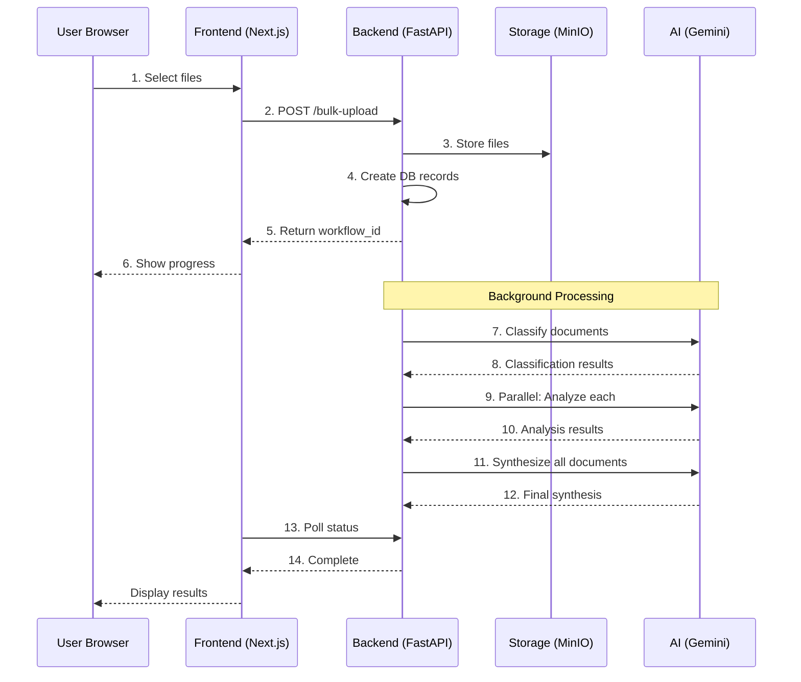
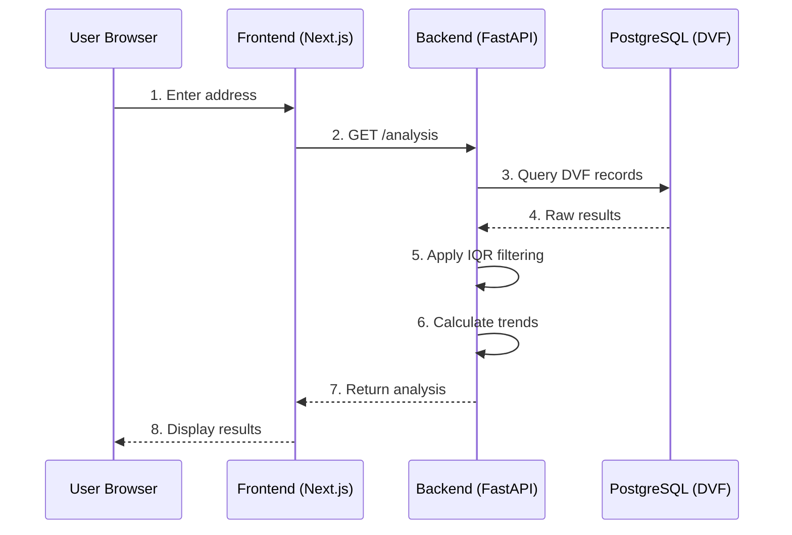
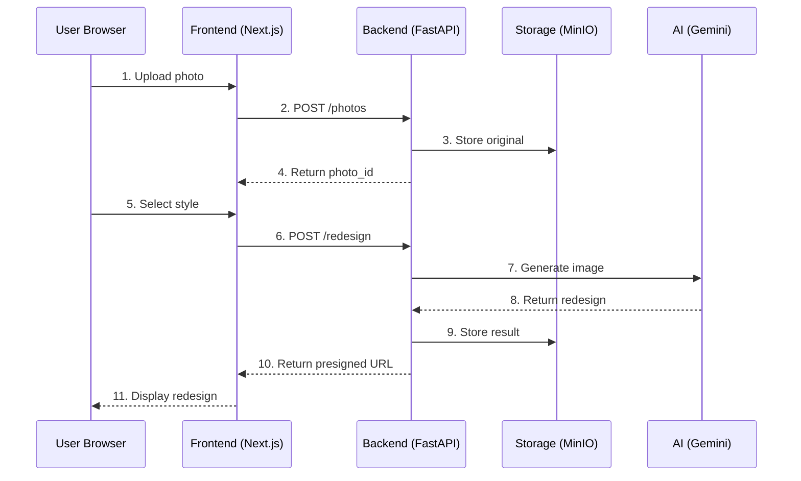
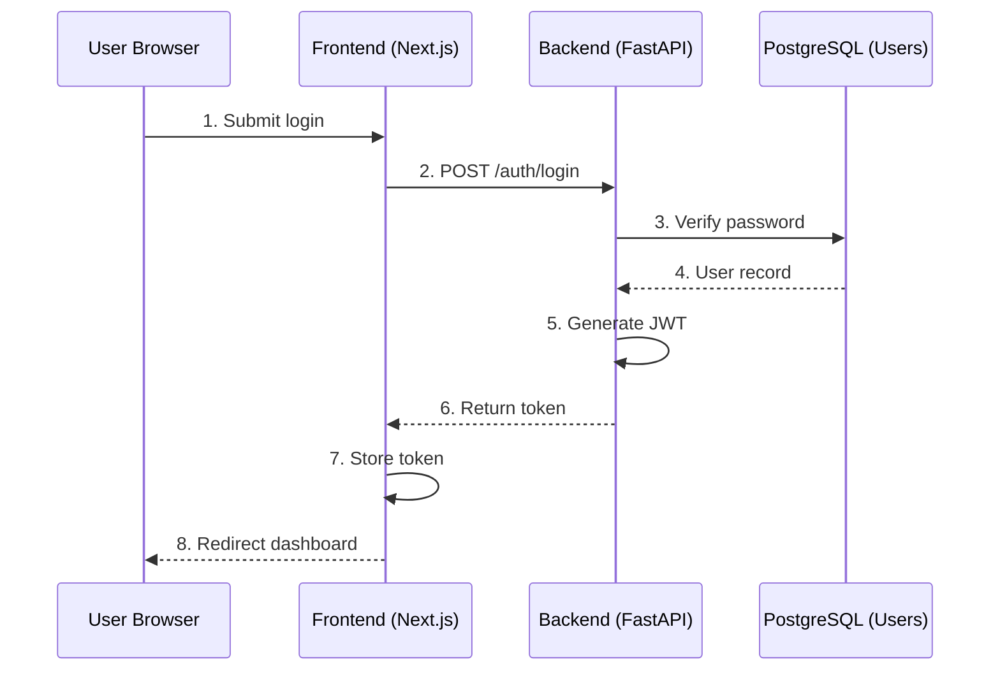

# Data Flow

This document describes how data flows through the AppArt Agent system for key operations.

## Document Upload and Analysis

The bulk document upload flow demonstrates the async processing architecture:

### Processing Stages

1. **Upload**: Files sent via multipart form data
2. **Storage**: Files stored in MinIO with SHA-256 hash for deduplication
3. **Classification**: AI identifies document types (PV AG, diagnostic, tax, charges)
4. **Analysis**: Parallel processing with type-specific prompts
5. **Synthesis**: Cross-document analysis aggregating costs and risks

## Price Analysis Flow

### Analysis Types

| Type | Data Source | Purpose |
|------|-------------|---------|
| Simple | Exact address matches | Historical sales at property |
| Trend | Neighboring properties | Price evolution and projections |
| Market | Area-wide data | Comparative market analysis |

## Photo Redesign Flow

## Authentication Flow

## Data Processing Pipeline

```mermaid
flowchart LR
    subgraph Upload["1. Upload"]
        A[Files] --> B[Multipart Form]
    end

    subgraph Storage["2. Storage"]
        B --> C[SHA-256 Hash]
        C --> D[MinIO]
    end

    subgraph Classification["3. Classification"]
        D --> E[First Page Image]
        E --> F[Gemini Vision]
        F --> G[Document Type]
    end

    subgraph Analysis["4. Analysis"]
        G --> H[Type-specific Prompts]
        H --> I[Parallel Processing]
        I --> J[Structured Results]
    end

    subgraph Synthesis["5. Synthesis"]
        J --> K[Aggregate Costs]
        K --> L[Risk Assessment]
        L --> M[Recommendations]
    end
```

## Data Consistency

### Transaction Boundaries

- Document uploads: Single transaction for record creation
- Bulk processing: Per-document transactions with rollback capability
- DVF imports: Chunked transactions (30k records per batch)

### Caching Strategy

| Data | Cache | TTL | Invalidation |
|------|-------|-----|--------------|
| User sessions | Redis | 7 days | On logout |
| DVF queries | Redis | 1 hour | Time-based |
| Document metadata | PostgreSQL | N/A | On update |
| File content | MinIO/GCS | N/A | Manual delete |
