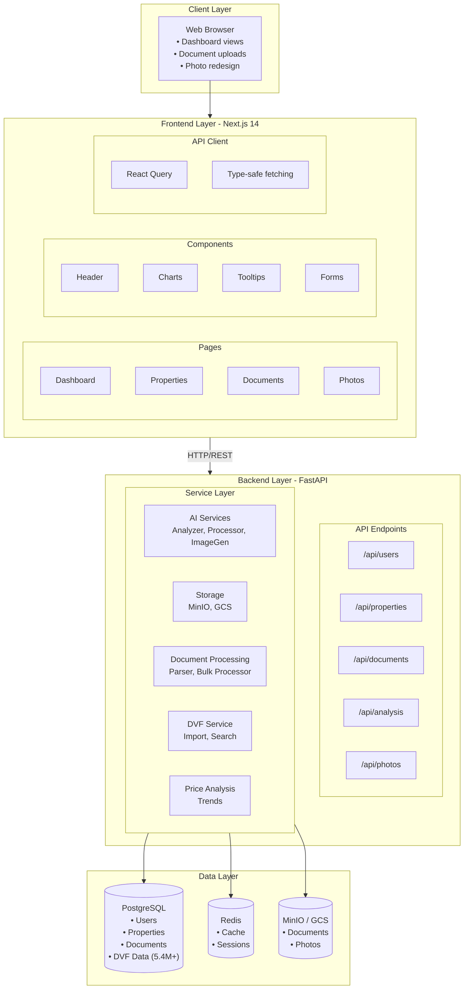
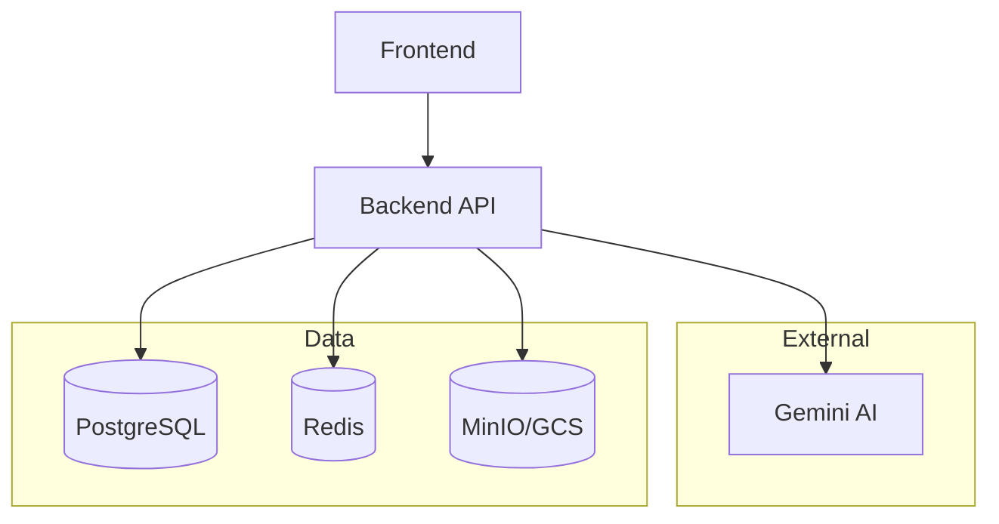
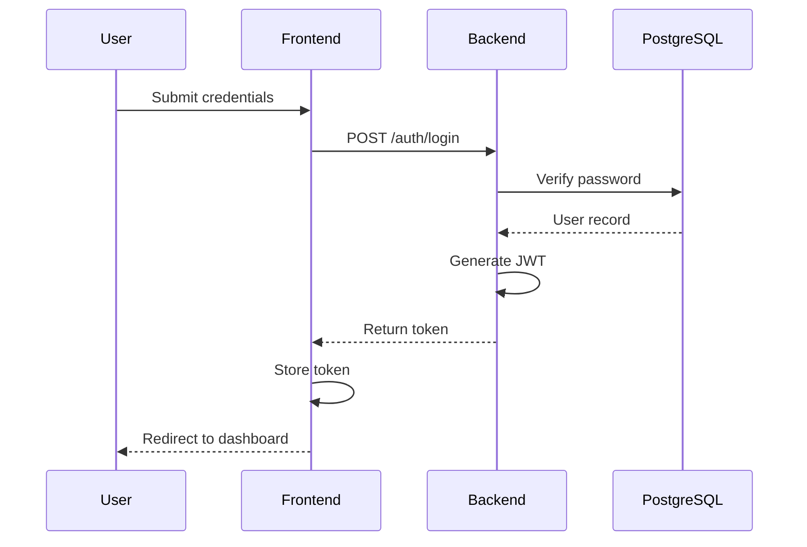

# System Overview

## High-Level Architecture

## Component Details

### Frontend (Next.js 14)

| Directory | Purpose |
|-----------|---------|
| `src/app/` | App Router pages and layouts |
| `src/components/` | Reusable React components |
| `src/contexts/` | React context providers (Auth) |
| `src/lib/` | Utilities and API client |
| `src/types/` | TypeScript type definitions |

**Key Technologies**:

- React 18 with Server Components
- Tailwind CSS for styling
- React Query for data fetching
- TypeScript for type safety

### Backend (FastAPI)

| Directory | Purpose |
|-----------|---------|
| `app/api/` | REST API route handlers |
| `app/core/` | Configuration, database, security |
| `app/models/` | SQLAlchemy ORM models |
| `app/schemas/` | Pydantic request/response schemas |
| `app/services/` | Business logic and integrations |
| `app/prompts/` | AI prompt templates |

**Key Technologies**:

- FastAPI for async HTTP handling
- SQLAlchemy for ORM
- Pydantic for validation
- Google Generative AI SDK

### Data Layer

#### PostgreSQL

Stores structured data:

- User accounts and authentication
- Properties and their metadata
- Documents and analysis results
- DVF records (5.4M+ property transactions)

#### Redis

In-memory caching for:

- Session data
- Frequently accessed queries
- Rate limiting

#### MinIO / Google Cloud Storage

Object storage for:

- Uploaded documents (PDF, images)
- Generated images (photo redesigns)
- Presigned URLs for secure access

## Service Dependencies

## Security Architecture

### Authentication Flow

### API Security

- **CORS**: Restricted to allowed origins
- **Rate Limiting**: Redis-based request throttling
- **Input Validation**: Pydantic schema validation
- **SQL Injection Prevention**: SQLAlchemy parameterized queries

### Storage Security

- **MinIO**: Access keys for authentication
- **GCS**: Service account with IAM roles
- **Presigned URLs**: Time-limited access to files
