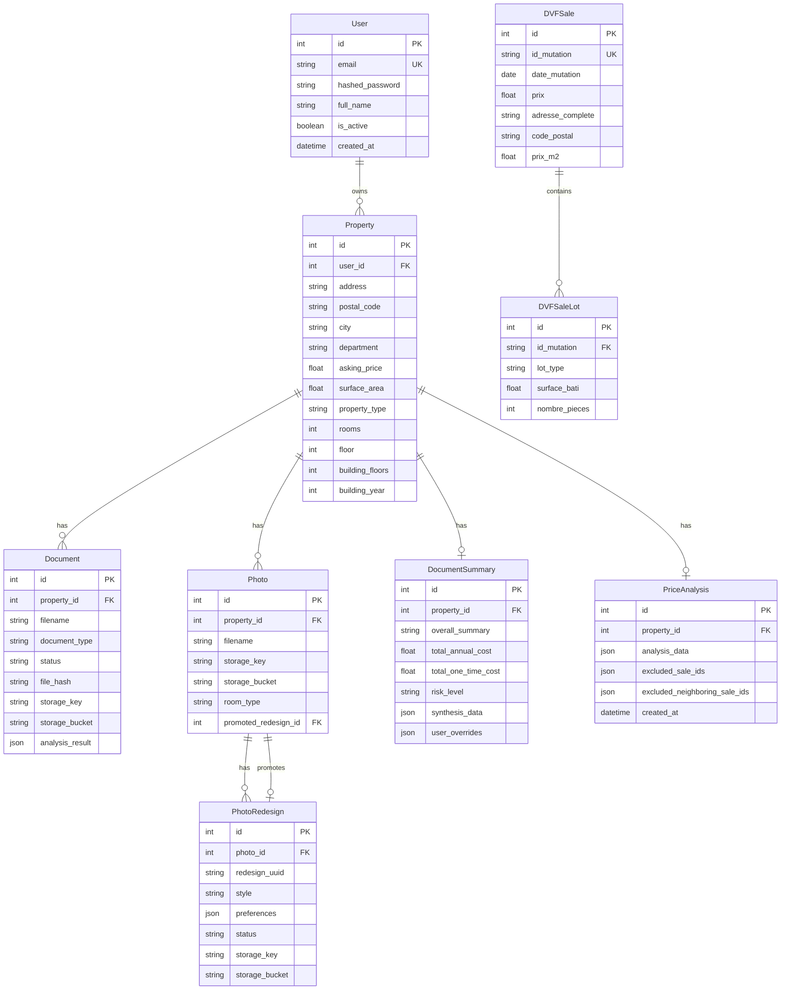

# Database & Models

AppArt Agent uses PostgreSQL with SQLAlchemy ORM for data persistence.

## Database Connection

Configuration in `app/core/database.py`:

```python
from sqlalchemy import create_engine
from sqlalchemy.orm import sessionmaker, declarative_base

DATABASE_URL = settings.DATABASE_URL
engine = create_engine(DATABASE_URL)
SessionLocal = sessionmaker(autocommit=False, autoflush=False, bind=engine)
Base = declarative_base()
```

## Models

### User

```python
# app/models/user.py
class User(Base):
    __tablename__ = "users"

    id: int                    # Primary key
    email: str                 # Unique, indexed
    hashed_password: str       # bcrypt hash
    full_name: str
    is_active: bool = True
    created_at: datetime
    updated_at: datetime

    # Relationships
    properties: List[Property]
```

### Property

```python
# app/models/property.py
class Property(Base):
    __tablename__ = "properties"

    id: int
    user_id: int               # Foreign key
    address: str
    postal_code: str           # Indexed
    city: str
    department: str
    asking_price: float
    surface_area: float
    property_type: str         # apartment, house
    rooms: int
    floor: int
    building_floors: int       # Total floors in the building
    building_year: int
    created_at: datetime
    updated_at: datetime

    # Relationships
    user: User
    documents: List[Document]
    photos: List[Photo]
```

### Document

```python
# app/models/document.py
class Document(Base):
    __tablename__ = "documents"

    id: int
    property_id: int           # Foreign key
    filename: str
    original_filename: str
    document_type: str         # pv_ag, diags, taxe_fonciere, charges, other
    status: str                # pending, processing, analyzed, failed
    file_hash: str             # SHA-256 for deduplication
    storage_key: str           # Storage object key (renamed from minio_key)
    storage_bucket: str        # Storage bucket name (renamed from minio_bucket)
    analysis_result: JSON      # Structured analysis
    created_at: datetime
    updated_at: datetime

    # Relationships
    property: Property
```

### Photo

```python
# app/models/photo.py
class Photo(Base):
    __tablename__ = "photos"

    id: int
    property_id: int
    filename: str
    storage_key: str           # Storage object key (renamed from minio_key)
    storage_bucket: str        # Storage bucket name (renamed from minio_bucket)
    room_type: str             # living_room, bedroom, kitchen, etc.
    promoted_redesign_id: int  # FK to photo_redesigns (featured redesign)
    created_at: datetime

    # Relationships
    property: Property
    redesigns: List[PhotoRedesign]
    promoted_redesign: PhotoRedesign  # The promoted/featured redesign

class PhotoRedesign(Base):
    __tablename__ = "photo_redesigns"

    id: int
    photo_id: int
    redesign_uuid: str         # Unique identifier
    style: str
    preferences: JSON
    status: str                # pending, generating, completed, failed
    storage_key: str           # Storage object key (renamed from minio_key)
    storage_bucket: str        # Storage bucket name (renamed from minio_bucket)
    created_at: datetime
```

### DVFSale & DVFSaleLot

```python
# app/models/property.py
class DVFSale(Base):
    __tablename__ = "dvf_sales"

    id: int
    id_mutation: str           # Unique transaction ID (indexed)
    date_mutation: date        # Sale date
    nature_mutation: str       # Type: Vente, Échange, etc.
    prix: float                # Total transaction price
    adresse_numero: str        # Street number
    adresse_nom_voie: str      # Street name
    adresse_complete: str      # Computed full address (GIN trigram indexed)
    code_postal: str           # Postal code (indexed)
    code_commune: str          # INSEE commune code
    nom_commune: str           # City name
    code_departement: str      # Department code
    longitude: float           # Longitude
    latitude: float            # Latitude
    type_principal: str        # Primary property type
    surface_bati: float        # Total built surface
    nombre_pieces: int         # Total rooms
    surface_terrain: float     # Land surface
    nombre_lots: int           # Number of lots
    n_appartements: int
    n_maisons: int
    n_dependances: int
    n_parcelles_terrain: int
    prix_m2: float             # Price per sqm (indexed)
    annee: int                 # Year

    # Indexes
    # - (code_postal, type_principal) composite
    # - (code_postal, type_principal, date_mutation) composite
    # - adresse_complete (GIN trigram for fuzzy search)
    # - prix_m2 (partial index WHERE prix_m2 IS NOT NULL)

class DVFSaleLot(Base):
    __tablename__ = "dvf_sale_lots"

    id: int
    id_mutation: str           # Foreign key to DVFSale
    lot_type: str              # Appartement, Maison, Dépendance, Terrain
    nature_culture: str        # Land type
    surface_bati: float        # Built surface of this lot
    nombre_pieces: int         # Rooms in this lot
    surface_terrain: float     # Land surface of this lot
    id_parcelle: str           # Cadastral parcel ID
    longitude: float           # Lot-specific longitude
    latitude: float            # Lot-specific latitude
```

### DocumentSummary

```python
# app/models/analysis.py
class DocumentSummary(Base):
    __tablename__ = "document_summaries"

    id: int
    property_id: int           # Foreign key
    overall_summary: str
    total_annual_cost: float
    total_one_time_cost: float
    risk_level: str            # low, medium, high
    recommendations: JSON
    synthesis_data: JSON       # Full synthesis result
    last_updated: datetime

class PriceAnalysis(Base):
    __tablename__ = "price_analyses"

    id: int
    property_id: int           # Foreign key
    analysis_data: JSON        # Full DVF analysis result
    excluded_sale_ids: JSON    # Outlier sale IDs removed
    excluded_neighboring_sale_ids: JSON  # Trend outlier IDs removed
    created_at: datetime
    updated_at: datetime
```

## Entity Relationship Diagram



## Migrations

Managed with Alembic:

```bash
# Create migration
docker-compose exec backend alembic revision --autogenerate -m "Add new field"

# Apply migrations
docker-compose exec backend alembic upgrade head

# Rollback one migration
docker-compose exec backend alembic downgrade -1

# Show current version
docker-compose exec backend alembic current

# Show migration history
docker-compose exec backend alembic history
```

### Migration Files

```text
alembic/versions/
├── 30257fbe1e49_create_initial_tables.py
├── a1b2c3d4e5f6_add_minio_temporal_columns.py
├── b2c3d4e5f6g7_add_langgraph_fields.py
├── 19c3bf31bde4_add_photo_and_photoredesign_models.py
├── c4d5e6f7g8h9_add_redesign_uuid_to_photo_redesigns.py
├── 25ffc9523881_merge_photo_redesign_uuid_heads.py
├── i0j1k2l3m4n5_rename_minio_to_storage.py       # Rename minio_key/bucket → storage_key/bucket
├── j1k2l3m4n5o6_add_promoted_redesign_to_photos.py  # Add promoted_redesign_id FK
├── k2l3m4n5o6p7_add_building_floors_to_properties.py  # Add building_floors column
├── l3m4n5o6p7q8_migrate_dvf_to_geolocalized_schema.py  # Drop dvf_records, create dvf_sales + dvf_sale_lots
└── m4n5o6p7q8r9_add_price_analyses_table.py      # Add price_analyses table
```

## Indexes

### Performance Indexes

```sql
-- DVF address search (trigram for fuzzy matching)
CREATE INDEX idx_dvf_sales_address_gin ON dvf_sales
USING GIN (adresse_complete gin_trgm_ops);

-- Common query pattern (composite)
CREATE INDEX idx_dvf_sales_composite ON dvf_sales
(code_postal, type_principal);

-- Trend queries (composite with date)
CREATE INDEX idx_dvf_sales_composite_date ON dvf_sales
(code_postal, type_principal, date_mutation);

-- Price analysis (partial index)
CREATE INDEX idx_dvf_sales_prix_m2 ON dvf_sales (prix_m2)
WHERE prix_m2 IS NOT NULL;

-- Transaction lookup
CREATE INDEX idx_dvf_sales_id_mutation ON dvf_sales (id_mutation);

-- Lot lookup
CREATE INDEX idx_dvf_sale_lots_id_mutation ON dvf_sale_lots (id_mutation);

-- Document lookup
CREATE INDEX idx_documents_property ON documents (property_id);
CREATE INDEX idx_documents_status ON documents (status);
```

### Unique Constraints

```sql
-- Prevent duplicate DVF transactions
ALTER TABLE dvf_sales ADD CONSTRAINT uq_dvf_id_mutation
UNIQUE (id_mutation);

-- Prevent duplicate documents (by hash)
ALTER TABLE documents ADD CONSTRAINT uq_doc_hash
UNIQUE (property_id, file_hash);
```

## Querying Examples

### Find Properties

```python
from app.models.property import Property
from sqlalchemy.orm import Session

def get_user_properties(db: Session, user_id: int):
    return db.query(Property).filter(
        Property.user_id == user_id
    ).all()
```

### DVF Search

```python
from app.models.property import DVFSale
from sqlalchemy import func

def search_dvf(db: Session, address: str, postal_code: str):
    return db.query(DVFSale).filter(
        DVFSale.code_postal == postal_code,
        func.similarity(DVFSale.adresse_complete, address) > 0.3
    ).order_by(
        func.similarity(DVFSale.adresse_complete, address).desc()
    ).limit(100).all()
```

### Aggregations

```python
from sqlalchemy import func

def get_price_stats(db: Session, postal_code: str, year: int):
    return db.query(
        func.count(DVFSale.id).label('count'),
        func.avg(DVFSale.prix_m2).label('avg_price'),
        func.min(DVFSale.prix_m2).label('min_price'),
        func.max(DVFSale.prix_m2).label('max_price')
    ).filter(
        DVFSale.code_postal == postal_code,
        DVFSale.annee == year
    ).first()
```

## Query Optimizations

### N+1 Query Fix

The `/api/properties/with-synthesis` endpoint was optimized from 3N+1 queries to 4 total queries. Instead of fetching related data per-property in a loop, it uses batch `.in_()` fetches and dictionary lookups.

### Redis Caching Layer

Expensive read endpoints are cached in Redis via the fault-tolerant `app/core/cache.py` module. If Redis is unavailable, requests fall through to the database without error.

| Endpoint | Cache Key | TTL |
|----------|-----------|-----|
| `/api/properties/dvf-stats` | `dvf_stats` | 1 hour |
| `/api/properties/{id}/price-analysis` | `price_analysis_summary:{id}` | 30 min |
| `/api/properties/{id}/price-analysis/full` | `price_analysis_full:{id}` | 30 min |

Cache is invalidated on refresh or exclude-sales operations.

## Database Management

### Backup

```bash
# Create backup
docker-compose exec db pg_dump -U appart appart_agent > backup.sql

# Restore backup
docker-compose exec -T db psql -U appart appart_agent < backup.sql
```

### Query Stats

```sql
-- Check table sizes
SELECT
    relname as table_name,
    pg_size_pretty(pg_total_relation_size(relid)) as total_size
FROM pg_catalog.pg_statio_user_tables
ORDER BY pg_total_relation_size(relid) DESC;

-- Check index usage
SELECT
    indexrelname as index_name,
    idx_scan as times_used
FROM pg_stat_user_indexes
ORDER BY idx_scan DESC;
```
