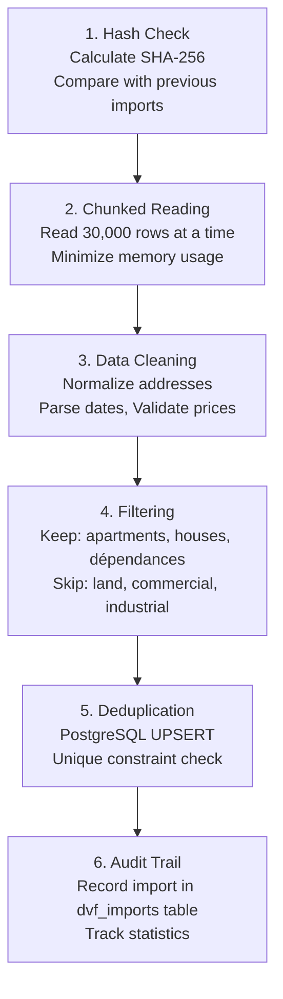

# DVF Data

DVF (Demandes de Valeurs Foncières) is France's open dataset of real estate transactions. Appartment Agent uses this data for price analysis and market trends.

## Overview

| Metric | Value |
|--------|-------|
| Total Records | 5.4M+ |
| Years Covered | 2022-2025 |
| Update Frequency | Quarterly |
| Source | data.gouv.fr |

### Records by Year

| Year | Records | Coverage |
|------|---------|----------|
| 2022 | 1,933,436 | Full year |
| 2023 | 1,518,590 | Full year |
| 2024 | 1,367,286 | Full year |
| 2025 | 567,471 | Q1-Q2 |

## Data Source

Official DVF data is published by the French government:

- **URL**: https://www.data.gouv.fr/fr/datasets/demandes-de-valeurs-foncieres/
- **Format**: Pipe-delimited CSV (|)
- **File Size**: ~400-600MB per year
- **Fields**: 40+ columns including address, price, surface area, property type

## Importing Data

### Download DVF Files

1. Visit [data.gouv.fr DVF](https://www.data.gouv.fr/fr/datasets/demandes-de-valeurs-foncieres/)
2. Download yearly files (e.g., `ValeursFoncieres-2024.txt`)
3. Save to `data/dvf/` directory

### Run Import

```bash
# Basic import
docker-compose exec backend python scripts/import_dvf_chunked.py \
  data/dvf/ValeursFoncieres-2024.txt --year 2024

# With custom chunk size (for memory-constrained systems)
docker-compose exec backend python scripts/import_dvf_chunked.py \
  data/dvf/ValeursFoncieres-2024.txt --year 2024 --read-chunk-size 20000

# Force re-import (bypass hash check)
docker-compose exec backend python scripts/import_dvf_chunked.py \
  data/dvf/ValeursFoncieres-2024.txt --year 2024 --force
```

### Import Options

| Option | Default | Description |
|--------|---------|-------------|
| `--year` | Required | Data year being imported |
| `--read-chunk-size` | 30000 | Rows per batch |
| `--force` | false | Re-import even if file hash matches |

## Import Process

The chunked importer handles large files efficiently:



### Performance

| Metric | Value |
|--------|-------|
| Processing Speed | ~1,000 records/sec |
| 600MB File | ~5 minutes |
| Memory Usage | ~200MB (chunked) |

## Data Schema

### DVFRecord Model

```python
class DVFRecord(Base):
    id: int
    sale_date: date           # Date de mutation
    sale_price: float         # Valeur foncière
    address: str              # Adresse complète
    postal_code: str          # Code postal
    city: str                 # Commune
    property_type: str        # Type local
    surface_area: float       # Surface réelle bâti
    rooms: int               # Nombre de pièces
    price_per_sqm: float     # Calculated
    data_year: int           # Year of import
    import_batch_id: str     # For rollback
```

### Property Types

| French | English | Included |
|--------|---------|----------|
| Appartement | Apartment | ✅ |
| Maison | House | ✅ |
| Dépendance | Storage/Annex | ✅ |
| Local industriel | Industrial | ❌ |
| Local commercial | Commercial | ❌ |

## Import Management

### View Import History

```bash
docker-compose exec db psql -U appartment -d appartment_agent -c "
SELECT 
    source_file,
    data_year,
    status,
    total_records,
    inserted_records,
    duration_seconds,
    started_at
FROM dvf_imports 
ORDER BY started_at DESC
LIMIT 10;
"
```

### Check Data by Year

```bash
docker-compose exec db psql -U appartment -d appartment_agent -c "
SELECT 
    data_year,
    COUNT(*) as records,
    MIN(sale_date) as earliest,
    MAX(sale_date) as latest
FROM dvf_records 
GROUP BY data_year 
ORDER BY data_year;
"
```

### Rollback Import

```bash
# List all imports
docker-compose exec backend python scripts/rollback_dvf_import.py --list

# Rollback specific import
docker-compose exec backend python scripts/rollback_dvf_import.py <batch_id>
```

## Data Validation

### Verify Import Completeness

```bash
# Total records
docker-compose exec db psql -U appartment -d appartment_agent -c "
SELECT COUNT(*) as total_records FROM dvf_records;
"

# Records per postal code (top 10)
docker-compose exec db psql -U appartment -d appartment_agent -c "
SELECT postal_code, COUNT(*) as count
FROM dvf_records
GROUP BY postal_code
ORDER BY count DESC
LIMIT 10;
"
```

### Test Specific Address

```python
# backend/scripts/test_address.py
from app.core.database import SessionLocal
from app.models.property import DVFRecord

db = SessionLocal()
records = db.query(DVFRecord).filter(
    DVFRecord.address.like('56 RUE NOTRE-DAME%')
).all()

print(f"Found {len(records)} sales")
for r in records:
    print(f"  {r.sale_date}: {r.sale_price:,.0f} EUR")
db.close()
```

## Search Optimization

### GIN Trigram Index

The database uses PostgreSQL trigram index for fuzzy address matching:

```sql
-- Enable extension
CREATE EXTENSION IF NOT EXISTS pg_trgm;

-- Create GIN index
CREATE INDEX idx_dvf_address_gin ON dvf_records 
USING GIN (address gin_trgm_ops);
```

### Search Query

```python
from sqlalchemy import func

def search_by_address(db, address: str, postal_code: str):
    return db.query(DVFRecord).filter(
        DVFRecord.postal_code == postal_code,
        func.similarity(DVFRecord.address, address) > 0.3
    ).order_by(
        func.similarity(DVFRecord.address, address).desc()
    ).limit(50).all()
```

## Price Analysis

### Simple Analysis

Returns historical sales at exact address:

```python
from app.services.dvf_service import DVFService

service = DVFService(db)
result = service.get_simple_analysis(
    address="56 Rue Notre-Dame des Champs",
    postal_code="75006"
)
```

### Trend Analysis

Projects prices using neighboring sales:

```python
result = service.get_trend_analysis(
    address="56 Rue Notre-Dame des Champs",
    postal_code="75006",
    surface_area=65.5
)
```

### IQR Outlier Filtering

Both analyses use IQR (Interquartile Range) to filter outliers:

```python
def filter_outliers(prices: List[float]) -> List[float]:
    q1 = np.percentile(prices, 25)
    q3 = np.percentile(prices, 75)
    iqr = q3 - q1
    lower = q1 - 1.5 * iqr
    upper = q3 + 1.5 * iqr
    return [p for p in prices if lower <= p <= upper]
```

## Troubleshooting

### Missing Sales

**Issue**: Search returns fewer sales than expected.

**Solution**: Verify data is imported:
```bash
docker-compose exec db psql -U appartment -d appartment_agent -c "
SELECT data_year, COUNT(*) FROM dvf_records 
WHERE postal_code = '75006' 
GROUP BY data_year;
"
```

### Slow Queries

**Issue**: Address search takes too long.

**Solution**: Verify GIN index exists:
```bash
docker-compose exec db psql -U appartment -d appartment_agent -c "
SELECT indexname FROM pg_indexes 
WHERE tablename = 'dvf_records' AND indexname LIKE '%gin%';
"
```

### Import Failures

**Issue**: Import crashes or hangs.

**Solution**: 
1. Check available memory
2. Reduce chunk size: `--read-chunk-size 10000`
3. Check disk space for PostgreSQL
