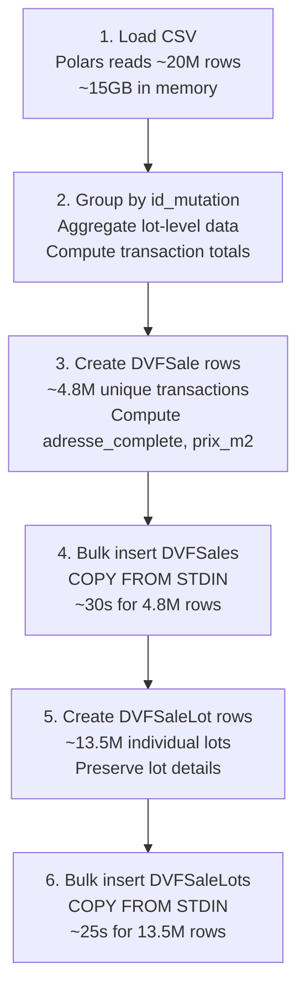

# DVF Data

DVF (Demandes de Valeurs Foncières) is France's open dataset of real estate transactions. AppArt Agent uses this geolocalized data for price analysis and market trends.

## Overview

| Metric | Value |
|--------|-------|
| Total Sales | 4.8M+ |
| Total Lots | 13.5M+ |
| Years Covered | 2015-2025 |
| Update Frequency | Quarterly |
| Source | data.gouv.fr |
| Geographic Coverage | Nationwide with lat/lon |

## Data Source

Official DVF data is published by the French government:

- **URL**: https://www.data.gouv.fr/fr/datasets/demandes-de-valeurs-foncieres-geolocalisees/
- **Format**: CSV with geolocalized coordinates
- **File Size**: ~3.5GB uncompressed (~20M rows)
- **Fields**: 43 columns including address, price, surface area, property type, latitude, longitude

**Key difference from original DVF**: This is a pre-processed geolocalized version with:

- Computed lat/lon coordinates for each transaction
- Cleaned and normalized addresses
- Aggregated by unique transaction (id_mutation)
- One row per lot sold

## New Schema (March 2026)

The project migrated from the old monolithic `dvf_records` table to a normalized two-table schema:

### DVFSale (Transactions)

One row per real estate transaction (unique `id_mutation`).

```python
class DVFSale(Base):
    __tablename__ = "dvf_sales"

    id: int                           # Primary key
    id_mutation: str                  # Unique transaction ID (indexed)
    date_mutation: date               # Sale date
    nature_mutation: str              # Type: Vente, Échange, etc.
    prix: float                       # Total transaction price
    adresse_numero: str               # Street number
    adresse_nom_voie: str             # Street name
    adresse_complete: str             # Computed full address (GIN indexed)
    code_postal: str                  # Postal code (indexed)
    code_commune: str                 # INSEE commune code
    nom_commune: str                  # City name
    code_departement: str             # Department code
    longitude: float                  # Longitude
    latitude: float                   # Latitude
    type_principal: str               # Primary property type (Appartement, Maison, etc.)
    surface_bati: float               # Total built surface
    nombre_pieces: int                # Total rooms
    surface_terrain: float            # Land surface
    nombre_lots: int                  # Number of lots in transaction
    n_appartements: int               # Number of apartments
    n_maisons: int                    # Number of houses
    n_dependances: int                # Number of dependencies
    n_parcelles_terrain: int          # Number of land parcels
    prix_m2: float                    # Price per sqm (computed, indexed)
    annee: int                        # Year (extracted from date_mutation)
```

**Indexes**:

- Composite: `(code_postal, type_principal)`
- Composite: `(code_postal, type_principal, date_mutation)` for trend queries
- GIN trigram: `adresse_complete` for fuzzy address matching
- Partial: `prix_m2 WHERE prix_m2 IS NOT NULL` for price analysis

### DVFSaleLot (Individual Lots)

One row per lot within a transaction (many-to-one with DVFSale).

```python
class DVFSaleLot(Base):
    __tablename__ = "dvf_sale_lots"

    id: int                           # Primary key
    id_mutation: str                  # Foreign key to DVFSale
    lot_type: str                     # Type: Appartement, Maison, Dépendance, Terrain
    nature_culture: str               # Land type (for terrain lots)
    surface_bati: float               # Built surface of this lot
    nombre_pieces: int                # Rooms in this lot
    surface_terrain: float            # Land surface of this lot
    id_parcelle: str                  # Cadastral parcel ID
    longitude: float                  # Lot-specific longitude (if available)
    latitude: float                   # Lot-specific latitude (if available)
```

**Why two tables?**

- One transaction (`id_mutation`) can involve multiple lots (e.g., apartment + parking)
- Each lot has its own type, surface, and sometimes coordinates
- Aggregations at transaction level (DVFSale) are much faster
- Detailed lot analysis available when needed (DVFSaleLot)

## Data Import

### CLI Tools

Two new CLI commands are available via `uv run`:

#### 1. Download DVF

```bash
# Download the latest geolocalized DVF dataset
uv run download-dvf https://www.data.gouv.fr/fr/datasets/r/3004168d-bec4-44d9-a781-ef16f41856a2

# This will:
# - Download the CSV file (~3.5GB)
# - Extract to data/dvf/
# - Verify integrity
```

**Entry point**: `backend/scripts/download_dvf.py` (registered in root `pyproject.toml`)

#### 2. Import DVF

```bash
# Import downloaded DVF data into PostgreSQL
uv run import-dvf

# Options:
# --source data/dvf/dvf_geolocalized.csv  # Custom source file
# --limit 100000                          # Import only first N rows (for testing)
```

**Entry point**: `backend/scripts/import_dvf.py` (registered in root `pyproject.toml`)

### Import Process

The new importer uses Polars for fast CSV processing and PostgreSQL COPY for bulk inserts:


```mermaid
flowchart TD
    A["1. Load CSV<br/>Polars reads ~20M rows<br/>~15GB in memory"] --> B
    B["2. Group by id_mutation<br/>Aggregate lot-level data<br/>Compute transaction totals"] --> C
    C["3. Create DVFSale rows<br/>~4.8M unique transactions<br/>Compute adresse_complete, prix_m2"] --> D
    D["4. Bulk insert DVFSales<br/>COPY FROM STDIN<br/>~30s for 4.8M rows"] --> E
    E["5. Create DVFSaleLot rows<br/>~13.5M individual lots<br/>Preserve lot details"] --> F
    F["6. Bulk insert DVFSaleLots<br/>COPY FROM STDIN<br/>~25s for 13.5M rows"]
```

### Performance

| Metric | Value |
|--------|-------|
| Total Import Time | ~55 seconds |
| DVFSale Insert | ~30 seconds (4.8M rows) |
| DVFSaleLot Insert | ~25 seconds (13.5M rows) |
| Memory Usage | ~15GB peak (Polars groupby) |
| CPU | 4+ vCPU recommended |

**Why so fast?**

- Polars: columnar processing, parallel execution, lazy evaluation
- COPY FROM STDIN: PostgreSQL bulk insert protocol (50x faster than INSERT)
- No row-by-row processing: bulk operations only

### Street Address Normalization

The importer normalizes street addresses to match DVF abbreviations:

```python
STREET_TYPE_MAPPING = {
    "BOULEVARD": "BD",
    "AVENUE": "AV",
    "RUE": "RUE",
    "PLACE": "PL",
    "IMPASSE": "IMP",
    "CHEMIN": "CHE",
    "ALLEE": "ALL",
    # ... etc
}
```

This enables accurate address matching in `DVFService.get_exact_address_sales()`.

## DVF Service

The `DVFService` class provides high-level methods for price analysis:

### Methods

| Method | Purpose |
|--------|---------|
| `get_exact_address_sales()` | Find historical sales at exact address |
| `get_comparable_sales()` | Find similar properties in same postal code |
| `get_neighboring_sales_for_trend()` | Get recent sales in area for trend calculation |
| `calculate_market_trend()` | Compute monthly price trend from neighboring sales |
| `calculate_trend_based_projection()` | Project future price using trend |
| `calculate_price_analysis()` | Full analysis: exact + comparable + trend projection |

### Example: Price Analysis

```python
from app.services.dvf_service import DVFService

service = DVFService(db)
result = service.calculate_price_analysis(
    property_id=123,
    address="56 RUE NOTRE-DAME DES CHAMPS",
    postal_code="75006",
    surface_area=65.5,
    rooms=3,
    property_type="Appartement"
)

# Returns:
{
    "exact_match_sales": [...],          # Sales at same address
    "comparable_sales": [...],           # Similar properties in 75006
    "excluded_sale_ids": [1, 2, 3],      # Outliers removed by IQR
    "market_trend_monthly": 0.008,       # 0.8% monthly growth
    "market_trend_annual": 0.096,        # 9.6% annual growth
    "projected_price": 875000,           # Estimated value
    "projected_price_m2": 13360,
    "confidence": "medium",
    "excluded_neighboring_sale_ids": [4, 5]
}
```

### IQR Outlier Filtering

All analyses use IQR (Interquartile Range) to remove outliers:

```python
def filter_outliers(values: List[float]) -> List[float]:
    q1 = np.percentile(values, 25)
    q3 = np.percentile(values, 75)
    iqr = q3 - q1
    lower = q1 - 1.5 * iqr
    upper = q3 + 1.5 * iqr
    return [v for v in values if lower <= v <= upper]
```

Outliers are tracked in `excluded_sale_ids` and `excluded_neighboring_sale_ids`.

## Price Analysis Table

Results are cached in the `price_analyses` table:

```python
class PriceAnalysis(Base):
    __tablename__ = "price_analyses"

    id: int
    property_id: int                         # Foreign key to properties
    analysis_data: JSON                      # Full DVFService result
    excluded_sale_ids: JSON                  # Outlier IDs removed
    excluded_neighboring_sale_ids: JSON      # Trend outlier IDs removed
    created_at: datetime
    updated_at: datetime
```

This avoids re-computing expensive analyses and preserves historical snapshots.

## Production Deployment (GCP Cloud Run Job)

### Cloud Run Job: dvf-import

The import runs as a Cloud Run Job (not a service) to avoid timeout limits.
The job is defined in Terraform (`infra/terraform/main.tf`) and triggered manually.

```bash
# Execute the import
gcloud run jobs execute dvf-import --region europe-west1 --wait

# Check logs
gcloud run jobs executions logs dvf-import --region europe-west1
```

**Configuration**:

- **Memory**: 16 GiB
- **CPU**: 4 vCPU (Polars parallelism)
- **Timeout**: 30 minutes (actual: ~2 minutes including download)
- **Max retries**: 0 (fail fast for easier debugging)
- **VPC egress**: `PRIVATE_RANGES_ONLY` — Cloud SQL traffic goes through the VPC connector, public downloads (data.gouv.fr) bypass the VPC directly to the internet
- **Trigger**: Manual (via GitHub Actions workflow or `gcloud` command)

### GitHub Actions Workflows

#### 1. dvf-import.yml

Manual workflow to trigger DVF import. Optionally accepts a custom source URL.

```bash
# Via GitHub UI: Actions → DVF Import → Run workflow
# Or via CLI:
gh workflow run dvf-import.yml
```

#### 2. deploy.yml

Updates the DVF job image on each deploy to `main` so the next import
execution uses the latest code.

## Query Examples

### Find Sales at Address

```python
from app.services.dvf_service import DVFService

service = DVFService(db)
sales = service.get_exact_address_sales(
    address="56 RUE NOTRE-DAME DES CHAMPS",
    postal_code="75006"
)

for sale in sales:
    print(f"{sale.date_mutation}: {sale.prix:,.0f} EUR ({sale.prix_m2:,.0f} EUR/m²)")
```

### Comparable Sales (Same Postal Code + Type)

```python
comparables = service.get_comparable_sales(
    postal_code="75006",
    property_type="Appartement",
    surface_area=65.5,
    rooms=3,
    max_results=50
)

# Filters by:
# - Same postal code
# - Same property type
# - Surface within 20% (52.4-78.6 m²)
# - Rooms within ±1 (2-4 rooms)
# - Last 2 years
# - Sorted by date descending
```

### Market Trend (Neighboring Sales)

```python
trend = service.calculate_market_trend(
    postal_code="75006",
    property_type="Appartement",
    surface_area=65.5,
    rooms=3
)

print(f"Monthly trend: {trend['monthly_change']:.2%}")
print(f"Annual trend: {trend['annual_change']:.2%}")
```

## Data Validation

### Check Import Completeness

```bash
# Total sales
docker-compose exec db psql -U appart -d appart_agent -c "
SELECT COUNT(*) as total_sales FROM dvf_sales;
"

# Total lots
docker-compose exec db psql -U appart -d appart_agent -c "
SELECT COUNT(*) as total_lots FROM dvf_sale_lots;
"

# Sales by year
docker-compose exec db psql -U appart -d appart_agent -c "
SELECT annee, COUNT(*) as count
FROM dvf_sales
GROUP BY annee
ORDER BY annee;
"
```

### Check Index Usage

```bash
docker-compose exec db psql -U appart -d appart_agent -c "
SELECT
    schemaname,
    tablename,
    indexname,
    idx_scan as times_used
FROM pg_stat_user_indexes
WHERE tablename IN ('dvf_sales', 'dvf_sale_lots')
ORDER BY idx_scan DESC;
"
```

### Test Address Search

```python
from app.core.database import SessionLocal
from app.models.property import DVFSale
from sqlalchemy import func

db = SessionLocal()

# Fuzzy search using trigram similarity
sales = db.query(DVFSale).filter(
    DVFSale.code_postal == "75006",
    func.similarity(DVFSale.adresse_complete, "56 RUE NOTRE DAME CHAMPS") > 0.3
).order_by(
    func.similarity(DVFSale.adresse_complete, "56 RUE NOTRE DAME CHAMPS").desc()
).limit(10).all()

for sale in sales:
    print(f"{sale.adresse_complete} ({sale.date_mutation}): {sale.prix:,.0f} EUR")

db.close()
```

## Troubleshooting

### Missing Sales

**Issue**: Address search returns no results.

**Solutions**:

1. Check if postal code exists:

```sql
SELECT COUNT(*) FROM dvf_sales WHERE code_postal = '75006';
```

2. Check address normalization:

```python
from app.services.dvf_service import normalize_street

input_addr = "56 Boulevard Notre-Dame des Champs"
normalized = normalize_street(input_addr)
print(f"Searching for: {normalized}")  # "56 BD NOTRE DAME DES CHAMPS"
```

3. Use fuzzy search instead of exact match:

```python
# Exact match (may fail due to typos)
sales = db.query(DVFSale).filter_by(
    adresse_complete="56 RUE NOTRE DAME CHAMPS",
    code_postal="75006"
).all()

# Fuzzy match (more forgiving)
sales = db.query(DVFSale).filter(
    DVFSale.code_postal == "75006",
    func.similarity(DVFSale.adresse_complete, "56 RUE NOTRE DAME CHAMPS") > 0.3
).all()
```

### Slow Queries

**Issue**: Address search takes too long (>1s).

**Solutions**:

1. Verify GIN index exists:

```sql
SELECT indexname FROM pg_indexes
WHERE tablename = 'dvf_sales' AND indexname LIKE '%gin%';
```

2. Analyze table statistics:

```sql
ANALYZE dvf_sales;
```

3. Check query plan:

```sql
EXPLAIN ANALYZE
SELECT * FROM dvf_sales
WHERE code_postal = '75006'
  AND similarity(adresse_complete, '56 RUE NOTRE DAME CHAMPS') > 0.3
ORDER BY similarity(adresse_complete, '56 RUE NOTRE DAME CHAMPS') DESC
LIMIT 50;
```

Expected: Index Scan using idx_dvf_sales_composite or idx_dvf_sales_address_gin

### Import Failures

**Issue**: Import crashes or runs out of memory.

**Solutions**:

1. Increase available memory (15GB+ recommended)
2. Use `--limit` flag for testing:

```bash
uv run import-dvf --limit 100000  # Import only first 100k rows
```

3. Check disk space for PostgreSQL:

```bash
docker-compose exec db df -h /var/lib/postgresql/data
```

4. Check PostgreSQL logs:

```bash
docker-compose logs db | tail -100
```

## Migration from Old Schema

The migration from `dvf_records` → `dvf_sales + dvf_sale_lots` is handled by Alembic:

- **Migration file**: `backend/alembic/versions/l3m4n5o6p7q8_migrate_dvf_to_geolocalized_schema.py`
- **Drops**: `dvf_records`, `dvf_imports`, `dvf_stats`, `dvf_grouped_transactions` view
- **Creates**: `dvf_sales`, `dvf_sale_lots`, indexes

Run migration:

```bash
docker-compose exec backend alembic upgrade head
```

**No data is automatically migrated.** After running the migration, you must re-import DVF data using `uv run import-dvf`.
