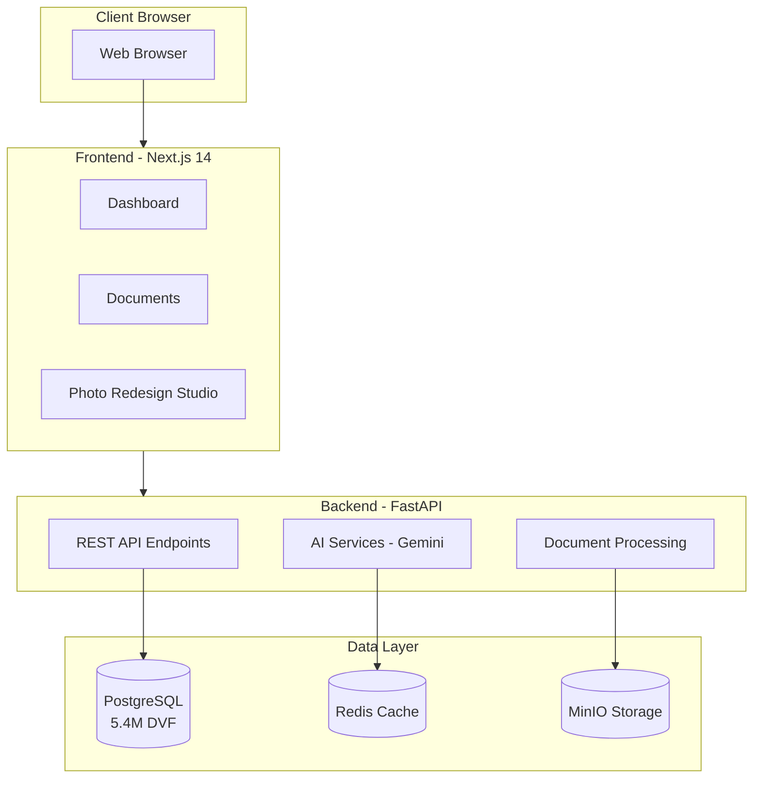

# Appartment Agent

**AI-powered apartment purchasing decision platform for France**

Appartment Agent helps buyers make informed real estate decisions by combining French property transaction data (DVF) with AI-powered document analysis and visualization tools.

## Features at a Glance

### Price Analysis

Access 5.4M+ French property transactions from DVF data to understand market prices, trends, and get personalized recommendations.

[Learn more →](backend/dvf-data.md)

### Document Analysis

Upload PV d'AG, diagnostics, tax documents - AI automatically classifies, analyzes, and synthesizes findings.

[Learn more →](backend/ai-services.md)

### Photo Redesign

Visualize renovation potential with AI-powered style transformation of apartment photos.

[Learn more →](backend/ai-services.md#image-generation)

### Decision Dashboard

Comprehensive cost breakdown, investment analysis, and risk assessment scoring.

[Learn more →](frontend/pages.md)

## Quick Start

```bash
# Clone and setup
git clone https://github.com/benjamin-karaoglan/appartment-agent.git
cd appartment-agent
cp .env.example .env
# Add your GOOGLE_CLOUD_API_KEY to .env

# Start services
docker-compose up -d
docker-compose exec backend alembic upgrade head

# Access
# Frontend: http://localhost:3000
# API Docs: http://localhost:8000/docs
```

[Full installation guide →](getting-started/quickstart.md)

## Architecture Overview



[Architecture details →](architecture/overview.md)

## Technology Stack

| Layer | Technologies |
|-------|--------------|
| **Frontend** | Next.js 14, React 18, TypeScript, Tailwind CSS, pnpm |
| **Backend** | FastAPI, Python 3.10+, SQLAlchemy, UV |
| **AI/ML** | Google Gemini (multimodal vision), LangChain |
| **Database** | PostgreSQL 15, Redis 7 |
| **Storage** | MinIO (local), Google Cloud Storage (production) |
| **Infrastructure** | Docker, Terraform, GCP Cloud Run |

## Documentation Sections

- **[Getting Started](getting-started/index.md)** - Installation, prerequisites, and configuration
- **[Architecture](architecture/index.md)** - System design and data flow
- **[Backend](backend/index.md)** - API reference, AI services, database models
- **[Frontend](frontend/index.md)** - Pages, components, and UI patterns
- **[Deployment](deployment/index.md)** - Docker and GCP deployment guides
- **[Development](development/index.md)** - Local setup, testing, and contributing
